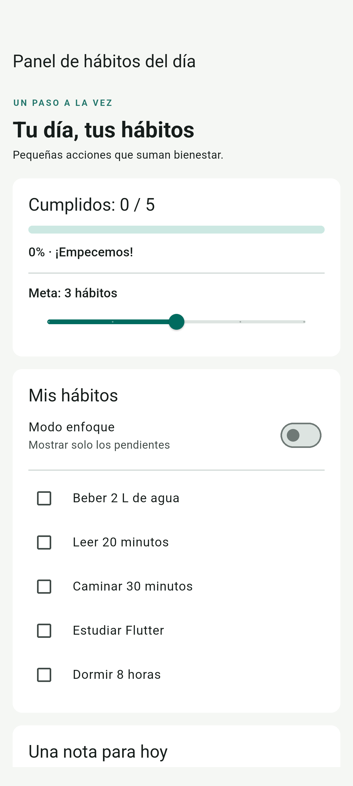
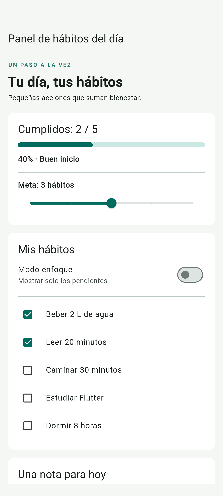
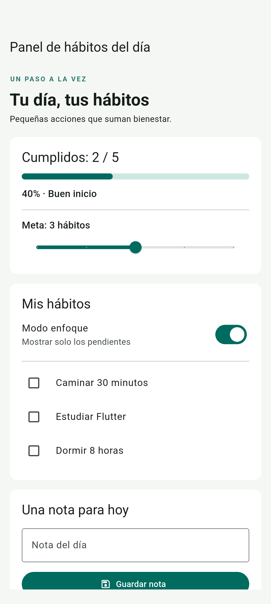
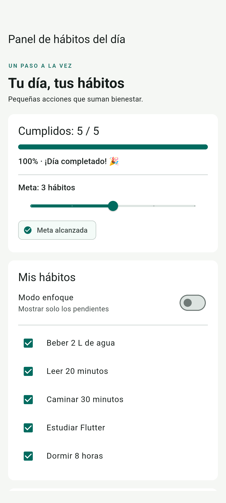
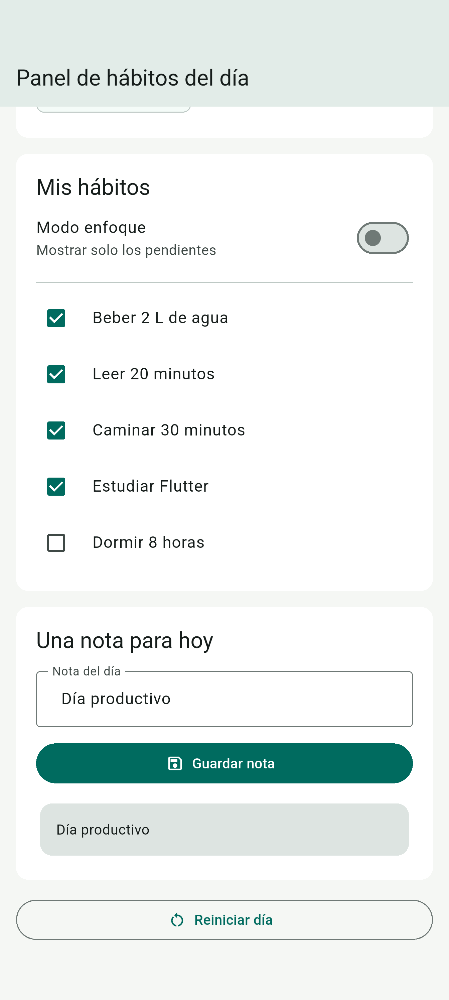

# Panel de hábitos del día

Aplicación Flutter para registrar cinco hábitos durante el día, observar el avance, ajustar una meta, concentrarse en pendientes y guardar una nota. Materia: Técnicas de Calidad de Software.

## Identificación

Proyecto Flutter: `e2_l1_alan_reyes`.

## Ejecutar

Abrir **esta carpeta raíz** en Android Studio (contiene `pubspec.yaml`), no la subcarpeta `android/app`. Seleccionar un emulador Android conectado y ejecutar `lib/main.dart`.

```sh
flutter pub get
flutter run
```

Alternativa web: `flutter run -d edge`. Verificado con Flutter 3.47.0 y Dart 3.13.0. El SDK Android y las licencias están disponibles. La compilación `flutter build apk --debug` fue satisfactoria. La versión final se ejecutó en el emulador Android 16 (API 36). Las seis capturas de esta entrega se obtienen directamente de la superficie Flutter Android con integration_test, mediante interacciones automatizadas con la aplicación real.

## Estado y diseño

La pantalla `PanelHabitos` es StatefulWidget. Toda la información mutable del día pertenece a su State:

| Variable | Tipo | Inicial | Propósito |
| --- | --- | --- | --- |
| cumplidos | List<bool> | Cinco false | Cumplimiento por índice original |
| meta | int | 3 | Objetivo entre 1 y 5 |
| enfoque | bool | false | Ocultar cumplidos sin borrar datos |
| nota | String | Vacía | Nota guardada, con trim |
| notaController | TextEditingController | Vacío | Texto en edición; se libera en dispose |

El contador, progreso, porcentaje, mensaje y meta alcanzada se calculan mediante getters. El progreso siempre usa los cinco hábitos como denominador, independientemente de la meta y del filtro. No existen contadores ni porcentajes duplicados en el estado. Las interacciones mutan el estado dentro de setState; initState inicializa y build únicamente construye la vista. No se usan gestores de estado externos ni ValueNotifier/ChangeNotifier para gestionar el estado; TextEditingController se utiliza porque lo exige el campo de texto.

La pantalla usa SafeArea, SingleChildScrollView y ancho máximo de 640. Se desplaza al abrir el teclado o al cambiar orientación. Guardar nota también funciona con la acción Listo del teclado. El texto vacío o solo espacios produce «Sin nota». Reiniciar borra hábitos, nota y campo, devuelve meta a 3 y desactiva enfoque. Los datos viven en memoria; cerrar la aplicación inicia otro día.

## Verificación realizada

`dart format lib test`, `flutter analyze` sin incidencias, y `flutter test`: **3 pruebas aprobadas**.

- 2/5 muestra 40% y Buen inicio; 5/5 muestra 100% y Día completado; desmarcar baja a 80% y Vas muy bien.
- Meta 2 con dos hábitos muestra el distintivo; meta 5 lo retira.
- Enfoque con dos cumplidos muestra tres; desactivarlo restaura cinco. Se marca Estudiar Flutter desde la vista filtrada y se verifica su índice original.
- Guardar «  Día productivo  » aplica trim; guardar espacios desde el teclado produce Sin nota.
- Reiniciar restaura todos los valores, incluyendo el campo del controlador.
- Sin excepciones de disposición a 320 × 640 y 800 × 360, con espacio de teclado de 220 y escala de texto 1.5, desplazándose hasta los controles inferiores. Son pruebas de widgets con teclado simulado; no equivalen a validar un teclado físico Android.

Las pruebas se encuentran en `test/widget_test.dart`. El recorrido de integración Android comprueba avance parcial, enfoque, restauración de cinco hábitos, 100%, desmarcar, nota con trim, vaciar y reinicio. Puede repetirse con el siguiente comando:

## Capturas reales

### Inicio


### Dos hábitos completados


### Enfoque: tres pendientes


### Día completado


### Nota guardada


### Reinicio


## Reflexión sobre calidad

Un error posible sería filtrar primero la lista y después usar la posición visible para modificar cumplidos: al ocultar los primeros hábitos, el siguiente aparecería en posición cero y se modificaría el hábito equivocado. Se previene recorriendo los índices originales y filtrando solo la presentación. La prueba marca Estudiar Flutter con el filtro activo y comprueba su estado al recuperar la lista completa.

Durante la implementación, el análisis sí detectó un error real: la prueba que genera Flutter todavía referenciaba MyApp después de reemplazar la pantalla. Se sustituyó por pruebas del panel y se volvió a ejecutar el análisis.

## Referencias

- [setState y reconstrucción](https://api.flutter.dev/flutter/widgets/State/setState.html)
- [Ciclo de vida de TextEditingController](https://api.flutter.dev/flutter/widgets/TextEditingController-class.html)

```sh
flutter drive --driver=test_driver/integration_test.dart --target=integration_test/panel_test.dart -d emulator-5554
```
